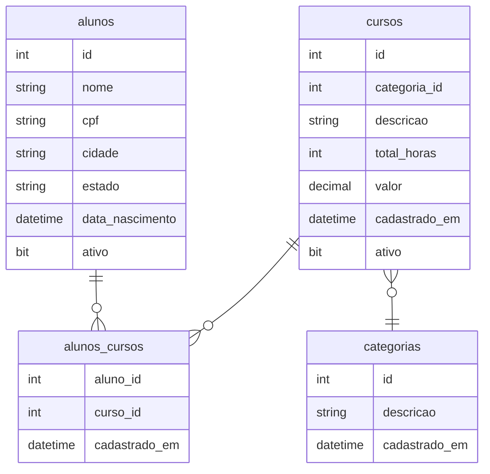

# Anotações

## Ambiente

### Instalação do SQL Server (Docker)

Gerei um arquivo `docker-compose.yaml` para facilitar a utilização do SQL Server, para utilizar o compose (após tudo instalado) basta rodar o seguinte comando no mesmo diretório onde o arquivo `docker-compose.yaml` está:

```bash
# Adicione --detach ou -d para que o docker não fique vinculado ao terminal
docker-compose up
```

E para parar:

```bash
docker-compose down
```

Obs.: caso exista algum problema ao inicializar o docker composer, tente executar o script `volume-to-sqlserver-user.sh` para que o docker possa acessar o volume de dados do SQL Server. Para adicionar commits git, é preciso voltar as permissões para o usuário atual, para isso execute `volume-to-current-user.sh`.

### Instalação do Azure Data Studio

Enquanto não existe uma verão flatpak do Azure Data Studio, eu estou utilizando a versão AUR [azuredatastudio-bin](https://aur.archlinux.org/packages/azuredatastudio-bin) no archlinux.

## Hands-On-SQL Básico

Queries executadas na aula:

```sql
-- Criando um banco de dados
CREATE DATABASE DesenvolvedorIO;

-- Dropando o banco de dados
DROP DATABASE DesenvolvedorIO;

-- Forçando o banco a ser "SINGLE_USER" e depois dropando o banco
-- (truque para não ter problemas com o banco sendo utilizado por outra aplicação)
ALTER DATABASE DesenvolvedorIO SET SINGLE_USER WITH ROLLBACK IMMEDIATE;
DROP DATABASE DesenvolvedorIO;

-- Criando o banco de dados novamente
CREATE DATABASE DesenvolvedorIO;

-- Caso queira criar o banco definindo onde os arquivos estarão armazenados
-- pode utilizar o comando abaixo
CREATE DATABASE DesenvolvedorIO ON (Name = 'Dev_mdf', FILENAME = 'D:\teste.mdf')
LOG ON (Name = 'Dev_log', FILENAME = 'D:\teste.ldf')
```

### Criando uma tabela

Queries executadas na aula:

```sql
-- Criando uma tabela alunos (no banco DesenvolvedorIO)
CREATE TABLE alunos
(
    -- id chave primária com auto incremento
    id int PRIMARY KEY IDENTITY,
    -- nome até 80 caracteres não nulo
    nome VARCHAR(80) NOT NULL,
    -- cpf exatos 11 caracteres não nulo
    cpf CHAR(11) NOT NULL,
    -- data de nascimento do tipo date
    data_nascimento DATE,
    -- ativo do tipo bit (booleano) com valor padrão 1
    ativo bit DEFAULT 1
)
```

### Inserindo registros

```sql
-- Inserindo um registro na tabela alunos
INSERT INTO alunos (nome, cpf, data_nascimento, ativo) VALUES ('Rafael', '00000000001', GETDATE(), 0);

-- Inseringo multiplos registros
INSERT INTO alunos (nome, cpf, data_nascimento, ativo)
VALUES
('Eduardo', '00000000002', GETDATE(), 0),
('Bruno', '00000000003', GETDATE(), 0);
```

### Consultando registros

```sql
-- Consultando todos os dados de registros da tabela alunos
SELECT * FROM alunos;

-- Consultando nome e cpf de todos os registros da tabela alunos
SELECT nome, cpf FROM alunos;

-- Consulta utilizando alias para o campo nome
SELECT nome as nome_aluno, cpf FROM alunos;
```

### Atualizando registros

```sql
-- SELECT * FROM alunos;

/*
  UPDATE tabela
  SET campo=valor, campo1 = valor1, campo2 = campo2 + 'x'
  WHERE filtro
*/

-- Atualiza o nascimento para a data atual e o ativo para 1
UPDATE alunos SET data_nascimento=GETDATE(), ativo=1;
```

### Excluindo registros

```sql
-- Exclui todos os registros da tabela alunos
-- DELETE FROM alunos;

-- Mesmo efeito do comando anterior, porém muito mais performático
-- TRUNCATE TABLE alunos;

-- Exclui o primeiro registro da tabela alunos
-- DELETE TOP (1) FROM alunos;

-- Exclui 10% dos registro da tabela alunos
-- DELETE TOP (10) PERCENTE FROM alunos;

---

SELECT * FROM alunos;

---

DELETE TOP (1) FROM alunos;

---

SELECT * FROM alunos;

```

## Cláusulas e Operadores

### Colocando a mão na massa

Primeiro dropando a tabela do módulo anterior:

```sql
-- Dropando a tabela alunos
DROP TABLE alunos;

-- Verificando se a tabela foi dropada
SELECT * FROM alunos;
```

Criando uma nova tabela alunos:

```sql
CREATE TABLE alunos
(
  id int PRIMARY KEY IDENTITY,
  nome VARCHAR(80) NOT NULL,
  cpf CHAR(11) NOT NULL,
  cidade VARCHAR(60) NOT NULL,
  estado CHAR(2) NOT NULL,
  data_nascimento DATE,
  ativo bit DEFAULT 1
)
```

Criando uma nova tabela categorias:

```sql
CREATE TABLE categorias
(
  id int PRIMARY KEY IDENTITY,
  descricao VARCHAR(80) NOT NULL,
  cadastrado_em DATETIME DEFAULT GETDATE()
)
```

Criando uma nova tabela cursos:

```sql
CREATE TABLE cursos
(
  id int PRIMARY KEY IDENTITY,
  categoria_id INT NOT NULL,
  descricao VARCHAR(80) NOT NULL,
  total_horas INT NOT NULL,
  valor DECIMAL(12,2) NOT NULL DEFAULT 0,
  cadastrado_em DATETIME DEFAULT GETDATE(),
  ativo bit DEFAULT 1,
  CONSTRAINT fk_categoria_id FOREIGN KEY (categoria_id) REFERENCES categorias(id)
)
```

Criando uma nova tabela alunos_cursos:

```sql
CREATE TABLE alunos_cursos
(
  aluno_id INT NOT NULL,
  curso_id INT NOT NULL,
  cadastrado_em DATETIME DEFAULT GETDATE(),
  CONSTRAINT pk_alunos_cursos PRIMARY KEY (aluno_id, curso_id),
  CONSTRAINT fk_aluno_id FOREIGN KEY (aluno_id) REFERENCES alunos(id),
  CONSTRAINT fk_curso_id FOREIGN KEY (curso_id) REFERENCES cursos(id)
)
```

Inserindo registros na tabela aluno:

```sql
INSERT INTO alunos(nome, cpf, cidade, estado, data_nascimento) VALUES
  ('Rafael',  '00000000001', 'Aracaju',         'SE', '2000-01-01'),
  ('Eduardo', '00000000002', 'São Paulo',       'SP', '2000-02-02'),
  ('Bruno',   '00000000003', 'São Paulo',       'SP', '2000-03-03'),
  ('Tiago',   '00000000004', 'Rio de Janeiro',  'RJ', '2000-04-04'),
  ('Heloysa', '00000000005', 'Aracaju',         'SE', '2000-05-05');
```

Inserindo registros na tabela categorias:

```sql
INSERT INTO categorias(descricao) VALUES
  ('Acesso a dados'),
  ('Segurança'),
  ('WEB');
```

Inserindo registros na tabela cursos:

```sql
INSERT INTO cursos(descricao, categoria_id, total_horas, valor) VALUES
  ('EF Core',                         1,  17, 300),
  ('SQL Server',                      1,  5,  200),
  ('ASP.NET Core Enterprise',         3,  5,  200),
  ('Fundamentos de IdentityServer4',  2,  5,  200);
```

Inserindo registros na tabela alunos_cursos:

```sql
INSERT INTO alunos_cursos(aluno_id, curso_id) VALUES
  (1, 1),
  (1, 2),
  (2, 3),
  (3, 1),
  (4, 4),
  (5, 1),
  (5, 2),
  (5, 3);
```

Verificação dados cadastrados:

```sql
SELECT * FROM categorias;
```



### Distinct

Query de cidades/estados sem dados duplicados:

```sql
SELECT DISTINCT cidade, estado FROM alunos;
```

### Order By

Query de alunos ordenando por nome:

```sql
-- Ordem por nome (ASC default)
SELECT * FROM alunos ORDER BY nome;

-- Ordem por nome ascendente
SELECT * FROM alunos ORDER BY nome ASC;

-- Ordem por nome descendente
SELECT * FROM alunos ORDER BY nome DESC;

-- Ordem por (coluna indice 1) descendente
SELECT * FROM alunos ORDER BY 1 DESC;

-- Ordem por múltiplas colunas (obedecendo a ordem, ordenar por nome, depois cpf e por último estado)
SELECT * FROM alunos ORDER BY nome ASC, cpf DESC, estado ASC;
```

### Top/Fetch

Limitar registros retornados da base de dados (TOP):

```sql
-- Query retorna apenas 4 primeiros registros
SELECT TOP 4 * FROM alunos ORDER BY id;

-- Query retorna apenas os 10% primeiros registros (retorna 1 registro nessa aula)
SELECT TOP 10 PERCENT * FROM alunos ORDER BY id;

-- Obs.: outros bancos de dados normalmente usam "LIMIT" ao invés de "TOP"
-- Não funciona no SQL Server
SELECT * FROM alunos ORDER BY id LIMIT 100;
```

Começar a exibir resultados ignorando uma quantidade de registros (OFSET):

```sql
-- Query retorna os registros da tabela alunos, pulando os dois primeiros registros
SELECT * FROM alunos ORDER BY id OFFSET 2 ROWS;

-- Query retorna apenas dois registros da tabela alunos, pulando os dois primeiros registros
SELECT * FROM alunos ORDER BY id OFFSET 2 ROWS FETCH FIRST 2 ROWS ONLY;
```

### Where

```sql
-- Select de alunos com nome "Rafael"
SELECT * FROM alunos WHERE nome = 'Rafael';

-- Select de alunos com id maior ou igual a 3
SELECT * FROM alunos WHERE id >= 3;
```

### And/Or

```sql
-- Select de alunos com nome "Bruno" e id maior ou igual a 3
SELECT * FROM alunos WHERE id >= 3 AND nome='Bruno';

-- Select de alunos com nome "Bruno" ou "Heloysa" e com id maior ou igual a 3
SELECT * FROM alunos WHERE id >= 3 AND (nome='Bruno' OR nome='Heloysa');
```

### Like

```sql
-- Alunos que possuem o nome "Rafael"
SELECT * FROM alunos WHERE nome LIKE 'Rafael';

-- Alunos que o nome começa com "Ra"
SELECT * FROM alunos WHERE nome LIKE 'Ra%';

-- Alunos que o nome termina com "o"
SELECT * FROM alunos WHERE nome LIKE '%o';

-- Alunos que possuem o caractere "a" no nome
SELECT * FROM alunos WHERE nome LIKE '%a%';

-- Alunos que o nome começa com "R" e termina com "l"
SELECT * FROM alunos WHERE nome LIKE 'R%l';
```

### Max/Min

```sql
-- Maior id da tabela alunos
SELECT MAX(id) FROM alunos;

-- Menor id da tabela alunos
SELECT MIN(id) FROM alunos;

-- Registro de aluno que possui o maior id
SELECT * FROM alunos WHERE id = (SELECT MAX(id) FROM alunos);
```

### Count/Sum

```sql
-- Quantidade de registros na tabela cursos, total de horas somado e soma de valores
SELECT COUNT(*), SUM(total_horas), SUM(valor) FROM cursos;
```
