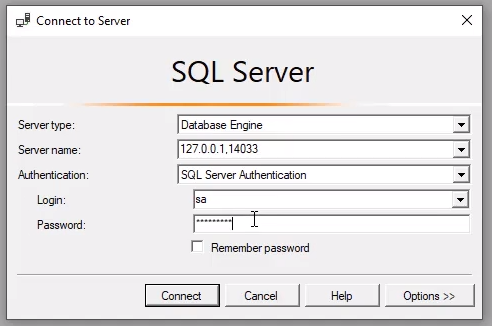
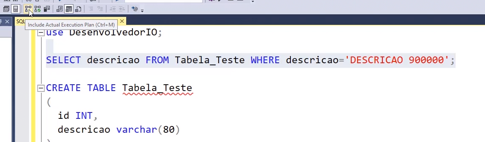

# Anotações

## Índice

- [Anotações](#anotações)
  - [Índice](#índice)
  - [Ambiente](#ambiente)
    - [Instalação do SQL Server (Docker)](#instalação-do-sql-server-docker)
    - [Instalação do Azure Data Studio](#instalação-do-azure-data-studio)
  - [Hands-On-SQL Básico](#hands-on-sql-básico)
    - [Criando uma tabela](#criando-uma-tabela)
    - [Inserindo registros](#inserindo-registros)
    - [Consultando registros](#consultando-registros)
    - [Atualizando registros](#atualizando-registros)
    - [Excluindo registros](#excluindo-registros)
  - [Cláusulas e Operadores](#cláusulas-e-operadores)
    - [Colocando a mão na massa](#colocando-a-mão-na-massa)
    - [Distinct](#distinct)
    - [Order By](#order-by)
    - [Top/Fetch](#topfetch)
    - [Where](#where)
    - [And/Or](#andor)
    - [Like](#like)
    - [Max/Min](#maxmin)
    - [Count/Sum](#countsum)
    - [Group By](#group-by)
    - [Having](#having)
    - [Operador In](#operador-in)
    - [Operador Between](#operador-between)
  - [Joins](#joins)
    - [Inner Join](#inner-join)
    - [Left Join](#left-join)
    - [Right Join](#right-join)
    - [Full Join](#full-join)
    - [Union/Union All](#unionunion-all)
  - [Transações](#transações)
    - [O que é uma transação?](#o-que-é-uma-transação)
    - [Criando uma transação](#criando-uma-transação)
    - [Save Point](#save-point)
  - [T-SQL](#t-sql)
    - [Conhecendo as funções](#conhecendo-as-funções)
      - [Links (documentação Microsoft)](#links-documentação-microsoft)
      - [Exemplos de funções](#exemplos-de-funções)
    - [Criando funções](#criando-funções)
    - [Criando uma Stored Procedure](#criando-uma-stored-procedure)
    - [Criando uma View](#criando-uma-view)
    - [Criando sequências](#criando-sequências)
    - [Criando um campo novo](#criando-um-campo-novo)
    - [Removendo coluna](#removendo-coluna)
    - [Renomeando objetos](#renomeando-objetos)
  - [Backup](#backup)
    - [Gerando backup](#gerando-backup)
    - [Restaurando backup](#restaurando-backup)
  - [Tips & Tricks](#tips--tricks)
    - [SQL Server Profiler](#sql-server-profiler)
    - [Hints SQL](#hints-sql)
    - [Plano de execução](#plano-de-execução)
    - [Usando corretamente o índice](#usando-corretamente-o-índice)
    - [Desfragmentando índices](#desfragmentando-índices)
    - [Contador de registros eficiente](#contador-de-registros-eficiente)
    - [CTE-Common Table Expression](#cte-common-table-expression)

## Ambiente

### Instalação do SQL Server (Docker)

Gerei um arquivo `docker-compose.yaml` para facilitar a utilização do SQL Server, para utilizar o compose (após tudo instalado) basta rodar o seguinte comando no mesmo diretório onde o arquivo `docker-compose.yaml` está:

```bash
# Adicione --detach ou -d para que o docker não fique vinculado ao terminal
docker-compose up
```

E para parar:

```bash
docker-compose down
```

Obs.: caso exista algum problema ao inicializar o docker composer, tente executar o script `volume-to-sqlserver-user.sh` para que o docker possa acessar o volume de dados do SQL Server. Para adicionar commits git, é preciso voltar as permissões para o usuário atual, para isso execute `volume-to-current-user.sh`.

### Instalação do Azure Data Studio

Enquanto não existe uma verão flatpak do Azure Data Studio, eu estou utilizando a versão AUR [azuredatastudio-bin](https://aur.archlinux.org/packages/azuredatastudio-bin) no archlinux.

## Hands-On-SQL Básico

Queries executadas na aula:

```sql
-- Criando um banco de dados
CREATE DATABASE DesenvolvedorIO;

-- Dropando o banco de dados
DROP DATABASE DesenvolvedorIO;

-- Forçando o banco a ser "SINGLE_USER" e depois dropando o banco
-- (truque para não ter problemas com o banco sendo utilizado por outra aplicação)
ALTER DATABASE DesenvolvedorIO SET SINGLE_USER WITH ROLLBACK IMMEDIATE;
DROP DATABASE DesenvolvedorIO;

-- Criando o banco de dados novamente
CREATE DATABASE DesenvolvedorIO;

-- Caso queira criar o banco definindo onde os arquivos estarão armazenados
-- pode utilizar o comando abaixo
CREATE DATABASE DesenvolvedorIO ON (Name = 'Dev_mdf', FILENAME = 'D:\teste.mdf')
LOG ON (Name = 'Dev_log', FILENAME = 'D:\teste.ldf')
```

### Criando uma tabela

Queries executadas na aula:

```sql
-- Criando uma tabela alunos (no banco DesenvolvedorIO)
CREATE TABLE alunos
(
    -- id chave primária com auto incremento
    id int PRIMARY KEY IDENTITY,
    -- nome até 80 caracteres não nulo
    nome VARCHAR(80) NOT NULL,
    -- cpf exatos 11 caracteres não nulo
    cpf CHAR(11) NOT NULL,
    -- data de nascimento do tipo date
    data_nascimento DATE,
    -- ativo do tipo bit (booleano) com valor padrão 1
    ativo bit DEFAULT 1
)
```

### Inserindo registros

```sql
-- Inserindo um registro na tabela alunos
INSERT INTO alunos (nome, cpf, data_nascimento, ativo) VALUES ('Rafael', '00000000001', GETDATE(), 0);

-- Inseringo multiplos registros
INSERT INTO alunos (nome, cpf, data_nascimento, ativo)
VALUES
('Eduardo', '00000000002', GETDATE(), 0),
('Bruno', '00000000003', GETDATE(), 0);
```

### Consultando registros

```sql
-- Consultando todos os dados de registros da tabela alunos
SELECT * FROM alunos;

-- Consultando nome e cpf de todos os registros da tabela alunos
SELECT nome, cpf FROM alunos;

-- Consulta utilizando alias para o campo nome
SELECT nome as nome_aluno, cpf FROM alunos;
```

### Atualizando registros

```sql
-- SELECT * FROM alunos;

/*
  UPDATE tabela
  SET campo=valor, campo1 = valor1, campo2 = campo2 + 'x'
  WHERE filtro
*/

-- Atualiza o nascimento para a data atual e o ativo para 1
UPDATE alunos SET data_nascimento=GETDATE(), ativo=1;
```

### Excluindo registros

```sql
-- Exclui todos os registros da tabela alunos
-- DELETE FROM alunos;

-- Mesmo efeito do comando anterior, porém muito mais performático
-- TRUNCATE TABLE alunos;

-- Exclui o primeiro registro da tabela alunos
-- DELETE TOP (1) FROM alunos;

-- Exclui 10% dos registro da tabela alunos
-- DELETE TOP (10) PERCENTE FROM alunos;

---

SELECT * FROM alunos;

---

DELETE TOP (1) FROM alunos;

---

SELECT * FROM alunos;

```

## Cláusulas e Operadores

### Colocando a mão na massa

Primeiro dropando a tabela do módulo anterior:

```sql
-- Dropando a tabela alunos
DROP TABLE alunos;

-- Verificando se a tabela foi dropada
SELECT * FROM alunos;
```

Criando uma nova tabela alunos:

```sql
CREATE TABLE alunos
(
  id int PRIMARY KEY IDENTITY,
  nome VARCHAR(80) NOT NULL,
  cpf CHAR(11) NOT NULL,
  cidade VARCHAR(60) NOT NULL,
  estado CHAR(2) NOT NULL,
  data_nascimento DATE,
  ativo bit DEFAULT 1
)
```

Criando uma nova tabela categorias:

```sql
CREATE TABLE categorias
(
  id int PRIMARY KEY IDENTITY,
  descricao VARCHAR(80) NOT NULL,
  cadastrado_em DATETIME DEFAULT GETDATE()
)
```

Criando uma nova tabela cursos:

```sql
CREATE TABLE cursos
(
  id int PRIMARY KEY IDENTITY,
  categoria_id INT NOT NULL,
  descricao VARCHAR(80) NOT NULL,
  total_horas INT NOT NULL,
  valor DECIMAL(12,2) NOT NULL DEFAULT 0,
  cadastrado_em DATETIME DEFAULT GETDATE(),
  ativo bit DEFAULT 1,
  CONSTRAINT fk_categoria_id FOREIGN KEY (categoria_id) REFERENCES categorias(id)
)
```

Criando uma nova tabela alunos_cursos:

```sql
CREATE TABLE alunos_cursos
(
  aluno_id INT NOT NULL,
  curso_id INT NOT NULL,
  cadastrado_em DATETIME DEFAULT GETDATE(),
  CONSTRAINT pk_alunos_cursos PRIMARY KEY (aluno_id, curso_id),
  CONSTRAINT fk_aluno_id FOREIGN KEY (aluno_id) REFERENCES alunos(id),
  CONSTRAINT fk_curso_id FOREIGN KEY (curso_id) REFERENCES cursos(id)
)
```

Inserindo registros na tabela aluno:

```sql
INSERT INTO alunos(nome, cpf, cidade, estado, data_nascimento) VALUES
  ('Rafael',  '00000000001', 'Aracaju',         'SE', '2000-01-01'),
  ('Eduardo', '00000000002', 'São Paulo',       'SP', '2000-02-02'),
  ('Bruno',   '00000000003', 'São Paulo',       'SP', '2000-03-03'),
  ('Tiago',   '00000000004', 'Rio de Janeiro',  'RJ', '2000-04-04'),
  ('Heloysa', '00000000005', 'Aracaju',         'SE', '2000-05-05');
```

Inserindo registros na tabela categorias:

```sql
INSERT INTO categorias(descricao) VALUES
  ('Acesso a dados'),
  ('Segurança'),
  ('WEB');
```

Inserindo registros na tabela cursos:

```sql
INSERT INTO cursos(descricao, categoria_id, total_horas, valor) VALUES
  ('EF Core',                         1,  17, 300),
  ('SQL Server',                      1,  5,  200),
  ('ASP.NET Core Enterprise',         3,  5,  200),
  ('Fundamentos de IdentityServer4',  2,  5,  200);
```

Inserindo registros na tabela alunos_cursos:

```sql
INSERT INTO alunos_cursos(aluno_id, curso_id) VALUES
  (1, 1),
  (1, 2),
  (2, 3),
  (3, 1),
  (4, 4),
  (5, 1),
  (5, 2),
  (5, 3);
```

Verificação dados cadastrados:

```sql
SELECT * FROM categorias;
```


### Distinct

Query de cidades/estados sem dados duplicados:

```sql
SELECT DISTINCT cidade, estado FROM alunos;
```

### Order By

Query de alunos ordenando por nome:

```sql
-- Ordem por nome (ASC default)
SELECT * FROM alunos ORDER BY nome;

-- Ordem por nome ascendente
SELECT * FROM alunos ORDER BY nome ASC;

-- Ordem por nome descendente
SELECT * FROM alunos ORDER BY nome DESC;

-- Ordem por (coluna indice 1) descendente
SELECT * FROM alunos ORDER BY 1 DESC;

-- Ordem por múltiplas colunas (obedecendo a ordem, ordenar por nome, depois cpf e por último estado)
SELECT * FROM alunos ORDER BY nome ASC, cpf DESC, estado ASC;
```

### Top/Fetch

Limitar registros retornados da base de dados (TOP):

```sql
-- Query retorna apenas 4 primeiros registros
SELECT TOP 4 * FROM alunos ORDER BY id;

-- Query retorna apenas os 10% primeiros registros (retorna 1 registro nessa aula)
SELECT TOP 10 PERCENT * FROM alunos ORDER BY id;

-- Obs.: outros bancos de dados normalmente usam "LIMIT" ao invés de "TOP"
-- Não funciona no SQL Server
SELECT * FROM alunos ORDER BY id LIMIT 100;
```

Começar a exibir resultados ignorando uma quantidade de registros (OFSET):

```sql
-- Query retorna os registros da tabela alunos, pulando os dois primeiros registros
SELECT * FROM alunos ORDER BY id OFFSET 2 ROWS;

-- Query retorna apenas dois registros da tabela alunos, pulando os dois primeiros registros
SELECT * FROM alunos ORDER BY id OFFSET 2 ROWS FETCH FIRST 2 ROWS ONLY;
```

### Where

```sql
-- Select de alunos com nome "Rafael"
SELECT * FROM alunos WHERE nome = 'Rafael';

-- Select de alunos com id maior ou igual a 3
SELECT * FROM alunos WHERE id >= 3;
```

### And/Or

```sql
-- Select de alunos com nome "Bruno" e id maior ou igual a 3
SELECT * FROM alunos WHERE id >= 3 AND nome='Bruno';

-- Select de alunos com nome "Bruno" ou "Heloysa" e com id maior ou igual a 3
SELECT * FROM alunos WHERE id >= 3 AND (nome='Bruno' OR nome='Heloysa');
```

### Like

```sql
-- Alunos que possuem o nome "Rafael"
SELECT * FROM alunos WHERE nome LIKE 'Rafael';

-- Alunos que o nome começa com "Ra"
SELECT * FROM alunos WHERE nome LIKE 'Ra%';

-- Alunos que o nome termina com "o"
SELECT * FROM alunos WHERE nome LIKE '%o';

-- Alunos que possuem o caractere "a" no nome
SELECT * FROM alunos WHERE nome LIKE '%a%';

-- Alunos que o nome começa com "R" e termina com "l"
SELECT * FROM alunos WHERE nome LIKE 'R%l';
```

### Max/Min

```sql
-- Maior id da tabela alunos
SELECT MAX(id) FROM alunos;

-- Menor id da tabela alunos
SELECT MIN(id) FROM alunos;

-- Registro de aluno que possui o maior id
SELECT * FROM alunos WHERE id = (SELECT MAX(id) FROM alunos);
```

### Count/Sum

```sql
-- Quantidade de registros na tabela cursos, total de horas somado e soma de valores
SELECT COUNT(*), SUM(total_horas), SUM(valor) FROM cursos;
```

### Group By

```sql
-- Cidades/estados sem items duplicados
SELECT cidade, estado FROM alunos GROUP BY cidade, estado;

-- Igual anterior + função de agregação Count (quantidade de registros por cidade/estado)
SELECT cidade, estado, COUNT(*) FROM alunos GROUP BY cidade, estado;
```

### Having

```sql
-- Cidades/estados com mais de um aluno
SELECT cidade, estado, COUNT(*) Total
FROM alunos 
GROUP BY cidade, estado
HAVING COUNT(*) > 1;
```

### Operador In

```sql
-- Alunos onde o id está entre os valores no array [2, 4]
SELECT * FROM alunos WHERE id IN (2,4);

-- Alunos onde o id está entre os valores resultados do subselect (SELECT id FROM alunos)
SELECT * FROM alunos WHERE id IN (SELECT id FROM alunos);
```

### Operador Between

```sql
-- Alunos onde o id está entre os valores 2 e 4 (inclusivamente)
SELECT * FROM alunos WHERE id BETWEEN 2 AND 4;
```

## Joins

### Inner Join

```sql
-- Todos os registros da tabela categorias
SELECT * FROM categorias;

-- Todos os registros da tabela cursos
SELECT * FROM cursos;

-- Join de todos os registros da tabela cursos com as categorias (onde categoria_id em curso é igual ao id da categoria)
SELECT * FROM cursos cr
INNER JOIN categorias ca
ON ca.id = cr.categoria_id;

-- Mesma query anterior porém apenas as colunas descrição (de curso e de categoria) e com alias para as colunas
SELECT cr.descricao Curso, ca.descricao Categoria
FROM cursos cr
INNER JOIN categorias ca
ON ca.id = cr.categoria_id;
```

### Left Join

Adição de nova categoria para a aula:

```sql
INSERT INTO categorias(descricao) VALUES('Categoria Test');
```

Queries com left join:

```sql
-- Mesma query que com inner join, porém se não existir um curso para a categoria, o registro para o a categoria retornará com um curso "NULL"
SELECT cr.descricao Curso, ca.descricao Categoria
FROM categorias ca
LEFT JOIN cursos cr
ON ca.id = cr.categoria_id;
```

Obs.: Differença entre `INNER JOIN` e `LEFT JOIN` é que o `INNER JOIN` você precisa ter dados em ambas as tabelas (ele apenas retorna registros que possuem uma relação entre as duas tabelas) enquanto que no `LEFT JOIN` você só precisa ter dados no "lado esquerdo" do join (categorias no exemplo).

### Right Join

```sql
-- Mesma coisa que LEFT JOIN, porém prioridade para o "lado direito" do join (categorias nesse exemplo)
SELECT cr.descricao Curso, ca.descricao Categoria
FROM cursos cr
RIGHT JOIN categorias ca
ON ca.id = cr.categoria_id;
```

### Full Join

```sql
-- Exemplo de join completo simulando uma situação em que ambos os lados não vão ter registros que batem os dados ((categoria_id+4) = ca.id nunca será verdadeiro porque só tem 4 categorias)
SELECT cr.descricao Curso, ca.descricao Categoria
FROM cursos cr
FULL JOIN categorias ca
ON ca.id = (cr.categoria_id+4);
```

### Union/Union All

```sql
-- "Merge" dos registros das duas consultas (tabela cursos onde id é 1 e tabela cursos onde id é 2)
SELECT * FROM cursos WHERE id = 1
UNION
SELECT * FROM cursos WHERE id = 2;

-- Union dos registros: descrição de curso id 1, descricao de categria id 2, "string" "Valor dinamico" e "string" "Valor dinamico"
-- Observação só serão retornados 3 resutlados porque o último valor está duplicado
SELECT descricao FROM cursos WHERE id = 1
UNION
SELECT descricao FROM categorias WHERE id = 2
UNION
SELECT 'Valor dinamico'
UNION
SELECT 'Valor dinamico';

-- Mesmo que o anterior, porém com 4 resultados porque UNION ALL retorna duplicados
SELECT descricao FROM cursos WHERE id = 1
UNION ALL
SELECT descricao FROM categorias WHERE id = 2
UNION ALL
SELECT 'Valor dinamico'
UNION ALL
SELECT 'Valor dinamico';
```

## Transações

### O que é uma transação?

Sequencia de Operações que são executadas na base de dados e que devem satisfazer as propriedades do ACID.

| A         | C           | I         | D          |
|-----------|-------------|-----------|------------|
| Atomicity | Consistency | Isolation | Durability |

- Atomicidade
  "Faz tudo ou não faz nada!"
  Em uma transação que envolve duas ou mais partes de informações, ou a transação será executada totalmente ou não será executada.
- Consistencia
  Garantir que o banco de dados esteja consistente antes e depois de uma transação, a transação deve sempre ser finalizada em um estado consistente.
- Isolamento
  Uma transação em andamento que ainda não foi confirmada deve permanecer totalmente isolada de outras operações, dessa forma o banco de dados garante que a transação não será interferida por nenhuma outra transação concorrente.
- Durabilidade
  Basicamente é fazer com que os dados sejam gravados em seu banco de dados, depois desse passo mesmo que o serviço de banco de dados seja reinicializado, seus dados ainda estão disponíveis para você acessar.

### Criando uma transação

Rollback:

```sql
-- Select todos dados de categorias
SELECT * FROM categorias;

-- Transaction com ROLLBACK
BEGIN TRANSACTION

UPDATE categorias
SET descricao=UPPER(descricao)
WHERE id > 0
GO

DELETE categorias WHERE id = 4
GO

-- Dados aparentam alterados dentro da transação
SELECT * FROM categorias;

-- Desfaz as mudanças da transaction
ROLLBACK

-- Os dados estão inalterados após a transação por causa do ROLLBACK (como estavam antes da transação)
SELECT * FROM categorias;
```

Observação: se a seção for fechada antes de um commit ou da transação ser finalizada, é executado um rollback.

Commit:

```sql
-- Select todos dados de categorias
SELECT * FROM categorias;

-- Transaction com ROLLBACK
BEGIN TRANSACTION

UPDATE categorias
SET descricao=UPPER(descricao)
WHERE id > 0;
GO

DELETE categorias WHERE id = 4;
GO

-- Dados aparentam alterados dentro da transação
SELECT * FROM categorias;

-- Commit da transação
COMMIT

-- Os dados estão alterados após a transação por causa do COMMIT
SELECT * FROM categorias;
```

### Save Point

```sql
-- Select todos dados de categorias
SELECT * FROM categorias;

BEGIN TRANSACTION

INSERT INTO categorias(descricao, cadastrado_em)
VALUES ('Categoria Nova 1', GETDATE());
INSERT INTO categorias(descricao, cadastrado_em)
VALUES ('Categoria Nova 2', GETDATE());
GO

-- Select mostra que novos dados foram incluídos
SELECT * FROM categorias;

SAVE TRANSACTION AtualizacaoPoint

UPDATE categorias
SET descricao = 'Aplicacao WEB'
WHERE descricao='WEB';
GO

-- Select mostra que "WEB" foi alterado para "Aplicacao WEB"
SELECT * FROM categorias;

-- Desfaz apenas as mudanças após o savepoint
ROLLBACK TRANSACTION AtualizacaoPoint

COMMIT

-- O resultado final é apenas a inserção das duas novas categorias sem alterar a categoria com descrição "WEB"
SELECT * FROM categorias;
```

## T-SQL

### Conhecendo as funções

#### Links (documentação Microsoft)

- pt_BR: [Quais são as funções do banco de dados SQL?](https://docs.microsoft.com/pt-br/sql/t-sql/functions/functions)
- en_US: [What are the SQL database functions?](https://docs.microsoft.com/en-us/sql/t-sql/functions/functions)

#### Exemplos de funções

[LEFT](https://docs.microsoft.com/pt-br/sql/t-sql/functions/left-transact-sql):

```sql
-- Apenas os 4 primeiros caracteres de descrição
SELECT LEFT(descricao, 4), descricao FROM categorias;
```

[RIGHT](https://docs.microsoft.com/pt-br/sql/t-sql/functions/right-transact-sql):

```sql
-- Apenas os 4 últimos caracteres de descrição
SELECT RIGHT(descricao, 4), descricao FROM categorias;
```

[SUBSTRING](https://docs.microsoft.com/pt-br/sql/t-sql/functions/substring-transact-sql):

```sql
-- A partir do segundo caractere, pega 5 caracteres de descrição
SELECT SUBSTRING(descricao, 2, 5), descricao FROM categorias;
```

[CONCAT](https://docs.microsoft.com/pt-br/sql/t-sql/functions/concat-transact-sql?view=sql-server-ver15):

```sql
-- Resultado: "RAFAEL  ALMEIDA"
SELECT 'RAFAEL ' + ' ALMEIDA';

-- Resultado: NULL (qualquer operação + NULL sempre será NULL)
SELECT 'RAFAEL ' + ' ALMEIDA' + NULL;

-- Resultado: "RAFAEL ALMEIDA SANTOS"
SELECT CONCAT('RAFAEL', ' ALMEIDA', ' SANTOS');

-- Colunas descricao de categorias concatenadas com a palavra " TESTE"
SELECT CONCAT(descricao, ' TESTE') FROM categorias;
```

[ISNULL](https://docs.microsoft.com/pt-br/sql/t-sql/functions/isnull-transact-sql?view=sql-server-ver15):

```sql
-- Retorna o valor da direita de o da esquerda for nulo
SELECT ISNULL(NULL, 'DEFAULT');

-- O campo descricao nunca será nulo nessa query
SELECT ISNULL(descricao, 'SEM DESCRICAO') FROM categorias;
```

[COALESCE](https://docs.microsoft.com/pt-br/sql/t-sql/language-elements/coalesce-transact-sql?view=sql-server-ver15):

```sql
-- Retorna o primeiro valor não nulo. "PRIMEIRO" nesse caso
SELECT COALESCE(null,null,null, 'PRIMEIRO', 'SEGUNDO');

-- Exemplo com cálculo
SELECT 2 * COALESCE(NULL, 1);

-- Exemplo hipotético vários telefones, retorna o primeiro não nulo
-- SELECT COALESCE(TEL1, TEL2, TEL3) FROM ...
```

[IIF](https://docs.microsoft.com/pt-br/sql/t-sql/functions/logical-functions-iif-transact-sql?view=sql-server-ver15):

```sql
-- Se o primeiro parametro for verdadeiro, retorna o segundo, senão retorna o terceiro
SELECT IIF(1 > 0, 'MAIOR QUE ZERO', 'MENOR QUE ZERO');
SELECT IIF(-1 > 0, 'MAIOR QUE ZERO', 'MENOR QUE ZERO');

-- Se o tamanho da descrição for maior que 5, retorna "MAIOR QUE 5", senão rentorna "MENOR QUE 5"
SELECT IIF(LEN(descricao) > 5, 'MAIOR QUE 5', 'MENOR QUE 5') FROM categorias;
```

[GETDATE](https://docs.microsoft.com/pt-br/sql/t-sql/functions/getdate-transact-sql?view=sql-server-ver15)

```sql
-- Retorna data e hora
SELECT GETDATE();
```

[CAST e CONVERT](https://docs.microsoft.com/pt-br/sql/t-sql/functions/cast-and-convert-transact-sql?view=sql-server-ver15):

```sql
-- Pega a data e hora com o GETDATE e converte apenas para DATA
SELECT CAST(GETDATE() AS DATE);

-- Pega a data e hora com o GETDATE e converte apenas para HORA
SELECT CAST(GETDATE() AS TIME);
```

### Criando funções

Criando a função Mascarar:

```sql
CREATE FUNCTION Mascarar(@data VARCHAR(255), @quantidadeCaracteres INT)
RETURNS VARCHAR(255)
AS
BEGIN
  RETURN LEFT(@data, @quantidadeCaracteres) + '**** ****';
END
```

Utilizando a função:

```sql
-- Resultado: "RAFA**** ****"
SELECT dbo.Mascarar('RAFAEL ALMEIDA', 4);

-- Descrição com "mascara"
SELECT dbo.Mascarar(descricao, 4) FROM categorias;
```

Criando a função ContarRegistros:  
Obs.: Não é recomendado consultas dentro de registros. Utilize com cuidado.

```sql
CREATE FUNCTION ContarRegistros()
RETURNS INT
AS
BEGIN
  RETURN (SELECT COUNT(*) FROM categorias);
END
```

Utilizando a função:

```sql
  SELECT dbo.ContarRegistros();
```

Criando a função GetCategoriaById:

```sql
CREATE FUNCTION GetCategoriaById(@id INT)
RETURNS TABLE
AS
RETURN (SELECT * FROM categorias WHERE id = @id);
```

Utilizando a função:

```sql
SELECT * from dbo.GetCategoriaById(1);
```

### Criando uma Stored Procedure

Criando a procedure PesquisarCategoriaPorId:

```sql
CREATE PROCEDURE PesquisarCategoriaPorId(@id INT)
AS
BEGIN
  SELECT * FROM categorias WHERE id = @id;
END
```

Utilizando a procedure:

```sql
-- Exemplo apenas com valor do parametro
EXECUTE dbo.PesquisarCategoriaPorId 1;

-- Exemplo informando o nome e valor do parametro
EXECUTE dbo.PesquisarCategoriaPorId @id=1;

-- Exemplo casa haja multiplos parametros
-- EXECUTE dbo.PesquisarCategoriaPorId @id=1, @novo=222;
```

Criando a procedure PersistirDadosEmCategorias:

```sql
CREATE PROCEDURE PersistirDadosEmCategorias(@descricao VARCHAR(255))
AS
BEGIN
  INSERT INTO categorias (descricao, cadastrado_em) VALUES (@descricao, GETDATE());
END
```

Utilizando a procedure:

```sql
EXECUTE dbo.PersistirDadosEmCategorias @descricao='Categoria Procedure';
```

Refazendo a procedure PersistirDadosEmCategorias com validação de dados:

```sql
-- Removendo a procedure
DROP PROCEDURE dbo.PersistirDadosEmCategorias;

-- Criando a procedure novamente
CREATE PROCEDURE PersistirDadosEmCategorias(@descricao VARCHAR(255))
AS
BEGIN
  IF(@descricao IS NULL)
  BEGIN
    RAISERROR('Descrição não é válida', 16, 1);
    RETURN
  END
  INSERT INTO categorias (descricao, cadastrado_em) VALUES (@descricao, GETDATE());
END
```

Utilizando a procedure:

```sql
EXECUTE dbo.PersistirDadosEmCategorias @descricao=NULL;
```

### Criando uma View

Criando a view vwCursos:

```sql
CREATE VIEW vwCursos
AS
SELECT c.descricao, ca.descricao categoria
FROM cursos c
INNER JOIN categorias ca
ON c.categoria_id=ca.id
```

Selects na view:

```sql
-- Select simples
SELECT * FROM vwCursos;

-- Select com where
SELECT * FROM vwCursos WHERE descricao='EF Core';
```

Dropando a view:

```sql
DROP VIEW vwCursos;
```

Alterando a view:

```sql
-- Recriando a view
CREATE VIEW vwCursos
AS
SELECT c.descricao, ca.descricao categoria
FROM cursos c
INNER JOIN categorias ca
ON c.categoria_id=ca.id

-- Alterando a view
ALTER VIEW vwCursos
AS
SELECT c.descricao, ca.descricao categoria, c.cadastrado_em
FROM cursos c
INNER JOIN categorias ca
ON c.categoria_id=ca.id
```

### Criando sequências

Criando sequência MinhaSequencia:

```sql
CREATE SEQUENCE MinhaSequencia
AS INT
START WITH 6
INCREMENT BY 1
MINVALUE 6
MAXVALUE 1000
-- CYCLE ou NO CYCLE 
-- NO CYCLE vai gerar uma excessão quando atingir o max
-- CYCLE retornaria para o min
NO CYCLE;
```

Chamando a sequência:

```sql
-- Retorna 6
SELECT NEXT VALUE FOR MinhaSequencia;

-- Retorna 7
SELECT NEXT VALUE FOR MinhaSequencia;
```

Exemplo com nova tabela:

```sql
-- Cria tabela teste
CREATE TABLE TabelaTeste
(
    id INT DEFAULT NEXT VALUE FOR MinhaSequencia,
    descricao VARCHAR(20)
);

-- Inserindo um registro
INSERT INTO TabelaTeste(descricao) VALUES ('Teste 01');

-- Verificando que o id vai ser 8 (o valor da sequência seguindo esses comandos)
SELECT * FROM TabelaTeste;

-- Inserindo mais um registro
INSERT INTO TabelaTeste(descricao) VALUES ('Teste 02');

-- Verificando que o id vai ser 9 (o valor da sequência seguindo esses comandos)
SELECT * FROM TabelaTeste;
```

### Criando um campo novo

Adicionando um campo novo na tabela categorias:

```sql
-- Adicionando o campo Teste, para adicionar mais campos, basta adicionar uma virgula e informar o novo campo (ex.: Teste VARCHAR(200) DEFAULT 'Teste', Teste2 VARCHAR(200) ...)
ALTER TABLE categorias
ADD Teste VARCHAR(200) DEFAULT 'Teste';
```

Verificar campo foi criado:

```sql
-- Campo Teste vai estar com valores NULL
SELECT * FROM categorias;
```

### Removendo coluna

```sql
-- Erro, não pode excluir por conta de constraint (default value para a coluna é uma constraint)
-- "The object 'DF__categoria__Teste__2739D489' is dependent on column 'Teste'."
ALTER TABLE categorias
DROP COLUMN Teste;

-- Removendo a constraint
ALTER TABLE categorias
DROP CONSTRAINT DF__categoria__Teste__2739D489;

-- Removendo a coluna
ALTER TABLE categorias
DROP COLUMN Teste;

-- Coluna não aparece mais no select, foi removida :)
SELECT * FROM categorias;
```

### Renomeando objetos

Renomeando coluna:

```sql
-- Adicionando coluna Teste
ALTER TABLE categorias
ADD Teste VARCHAR(100);

-- procedure sp_rename
-- primeiro parametro: nome do objeto
-- segundo parametro: novo nome
-- terceiro parametro: tipo do objeto
EXECUTE sp_rename 'dbo.categorias.Teste', 'Observacao', 'COLUMN';

-- Coluna Teste foi renomeada para Observacao
SELECT * FROM categorias;
```

Renomeando tabela:

```sql
EXECUTE sp_rename 'dbo.TabelaTeste', 'TabelaAlterada';
```

## Backup

### Gerando backup

Gerando backup da tabela na pasta padrão do container docker:  
Obs.: Devido a estar utilizando uma pasta dentro do repositório git como volume do docker, é possível ver o arquivo a partir do diretório raiz desse repositório com o caminho `./sqlvolume/data/AulaBackup.bak`.

```sql
USE DesenvolvedorIO;

-- Backup "full", com inicialização
BACKUP DATABASE DesenvolvedorIO
TO DISK = '/var/opt/mssql/data/AulaBackup.bak'
WITH INIT,
NAME = 'Backup do banco de dados';

-- Backup "diferencial"
BACKUP DATABASE DesenvolvedorIO
TO DISK = '/var/opt/mssql/data/AulaBackup-01.bak'
WITH DIFFERENTIAL,
NAME = 'Backup do banco de dados - Diferencial';
```

### Restaurando backup

```sql
-- Usar um banco que não seja o que vamos efetuar a restauração
USE master;

RESTORE DATABASE DesenvolvedorIO
FROM DISK = '/var/opt/mssql/data/AulaBackup.bak'
WITH REPLACE;
```

## Tips & Tricks

### SQL Server Profiler

O "SQL Server Profiler" vem junto com a instalação do [SQL Server Management Studio (SSMS)](https://docs.microsoft.com/pt-br/sql/ssms/download-sql-server-management-studio-ssms).

Como estou no linux irei utilizar apenas algumas imagens do profiler:

Vai ser utilizado apenas New Trace:


Ao clicar em New Trace, aparece a janela para se conectar ao banco:



Propriedades para o Trace:


Monitoria (executando comando):


### Hints SQL

Hints são recursos que são fornecidos por alguns bancos de dados relacionais que possibilita que no momento em que a gente está escrevendo as instruções SQL, podemos adicionar ali algum tipo de anotação para enviar para otimizador de consultas do próprio banco de dados para que ele possa ignorar o plano de execução que ele está trabalhando internamente.

Exemplo Hint NOLOCK:

```sql
-- Iniciando Transaction
BEGIN TRANSACTION
UPDATE categorias
SET descricao='Teste Com NOLOCK'
WHERE id=7

-- Select funciona normal na mesma conexão
SELECT * FROM categorias;
```

Em outra conexão:

```sql
-- Não retorna porque categorias está em lock
SELECT * FROM categorias;

-- Com o hint NOLOCK, retorna os registros
SELECT * FROM categorias WITH (NOLOCK);
```

Na primeira conexão ROLLBACK:

```sql
ROLLBACK
```

Observação: os dados da query com nolock não refletem os dados que realmente ficaram no banco nesse exemplo. O NOLOCK é conhecido como uma consulta suja, ele retorna todos os registros, mesmo os que estão dentro de uma transaction que ainda não foi finalizada, podendo retornar dados que foram deletados, estão sendo modificados, etc...

### Plano de execução

Será utilizado o "SQL Server Profiler" vem junto com a instalação do [SQL Server Management Studio (SSMS)](https://docs.microsoft.com/pt-br/sql/ssms/download-sql-server-management-studio-ssms) nessa aula... :(.

Script persistir 1 000 000 registros para teste.

```sql
use DesenvolvedorIO;

CREATE TABLE Tabela_Teste
(
  id INT,
  descricao varchar(80)
)

DECLARE @id INT = 1
DECLARE @p1 INT,@p2 INT,@p3 INT,@p4 INT
WHILE @id <= 200000
BEGIN 
  SET @p1=@id+200000
  SET @p2=@id+400000
  SET @p3=@id+600000
  SET @p4=@id+800000
  INSERT INTO Tabela_Teste(id, descricao) 
  VALUES (@id,'Descricao '+cast(@id as varchar(7))),
         (@p1,'Descricao '+cast(@p1 as varchar(7))),
         (@p2,'Descricao '+cast(@p2 as varchar(7))),
         (@p3,'Descricao '+cast(@p3 as varchar(7))),
         (@p4,'Descricao '+cast(@p4 as varchar(7)));
  SET @id = @id+1
END 
```




```sql
use DesenvolvedorIO;

SELECT descricao FROM Tabela_Teste WHERE descricao='DESCRICAO 900000';
```


Table Scan indica que ele teve que ir percorrendo a tabela para encontrar o registro e tentou encontrar o que atendesse o critério.


Custo de CPU elevado:


Criando índice para a consulta:

```sql
use DesenvolvedorIO;

-- Cria índice
CREATE INDEX idx_tabela_teste_descricao ON Tabela_Teste(descricao);

-- Novamente executar o select verificando o plano de execução
SELECT descricao FROM Tabela_Teste WHERE descricao='DESCRICAO 900000';
```

Agora a "Seta" está mais fina e o tipo mudo de Table Scan para Index Seek, o que indica que ele não precisou percorrer todos os registros para encontrar o que atendesse o critério, sendo assim muito mais otimizada.


### Usando corretamente o índice

Procure evitar usar funções nas clásulas para filtrar dados.

O execution plan indica que na query abaixo foi executado um "Table Scan":

```sql
SELECT descricao FROM Tabela_Teste Where LEFT(descricao,16)='DESCRICAO 900000';
```

A query abaixo utiliza o índice corretamente (Index Seek), tem o mesmo resultado da query anterior e é mais performática:

```sql
SELECT descricao FROM Tabela_Teste Where descricao LIKE 'DESCRICAO 900000%';
```


### Desfragmentando índices

Query para verificar fragmentação de índices:  
Observação 1: Entre 15% e 30% de fragmentação é recomendado executar uma reorganização dos índices.  
Observação 2: Acima de 30% é recomendado reconstruir os índices.

```sql
SELECT OBJECT_NAME(ips.object_id) AS object_name,
       i.name AS index_name, 
       ips.avg_fragmentation_in_percent, 
       ips.page_count
FROM sys.dm_db_index_physical_stats(DB_ID(), default, default, default, 'SAMPLED') AS ips
INNER JOIN sys.indexes AS i 
ON ips.object_id = i.object_id
   AND ips.index_id = i.index_id
   AND i.name IS NOT NULL
ORDER BY page_count DESC;
```

Reorganizar o índice da tabela:

```sql
-- Reorganiza o índice "idx_tabela_teste_descricao" da tabela "Tabela_Teste"
ALTER INDEX idx_tabela_teste_descricao ON Tabela_Teste REORGANIZE

-- Reorganiza todos os índices da tabela "Tabela_Teste"
ALTER INDEX ALL ON Tabela_Teste REORGANIZE
```

Reconstruir o índice:

```sql
-- Reconstrói o índice "idx_tabela_teste_descricao" da tabela "Tabela_Teste"
ALTER INDEX idx_tabela_teste_descricao ON Tabela_Teste REBUILD

-- Reconstrói todos os índices da tabela "Tabela_Teste"
ALTER INDEX ALL ON Tabela_Teste REBUILD
```

### Contador de registros eficiente

Utilizando Count (usa Table Scan):

```sql
SET STATISTICS IO, TIME ON

-- Executando 5x a query e copiando os tempos no comentário:
-- CPU time = 158 ms,  elapsed time = 162 ms.
-- CPU time = 65 ms,  elapsed time = 66 ms.
-- CPU time = 72 ms,  elapsed time = 83 ms.
-- CPU time = 140 ms,  elapsed time = 149 ms.
-- CPU time = 130 ms,  elapsed time = 137 ms.
SELECT COUNT(*) FROM Tabela_Teste WITH (NOLOCK)
```

Utilizando a view de sistema dm_db_partition_stats

```sql
SET STATISTICS IO, TIME ON

-- Executando 5x a query e copiando os tempos no comentário:
-- CPU time = 2 ms,  elapsed time = 2 ms.
-- CPU time = 0 ms,  elapsed time = 1 ms.
-- CPU time = 0 ms,  elapsed time = 0 ms.
-- CPU time = 1 ms,  elapsed time = 0 ms.
-- CPU time = 0 ms,  elapsed time = 2 ms.
SELECT SUM(s.row_count) FROM sys.dm_db_partition_stats s
WHERE OBJECT_NAME(object_id) = 'Tabela_Teste'
AND s.index_id IN(0,1);
```


### CTE-Common Table Expression

Query com dados de exemplo para a aula:

```sql
use DesenvolvedorIO;

CREATE TABLE produtos
(
  id int identity primary key,
  descricao varchar(100)
)
GO

CREATE TABLE pedidos
(
  id int identity primary key,
  data DATE,
  observacao VARCHAR(100)
)
GO


CREATE TABLE pedido_itens
(
  id int identity primary key,
  pedido_id INT,
  produto_id INT,
  quantidade INT,
  valor DECIMAL(12, 2),
  FOREIGN KEY(pedido_id) REFERENCES pedidos(id),
  FOREIGN KEY(produto_id) REFERENCES produtos(id),
)
GO


DECLARE @produtos INT = 1 
WHILE @produtos <= 50
BEGIN  
  INSERT INTO produtos(descricao)  VALUES ('PRODUTO '+cast(@produtos as varchar));
  SET @produtos = @produtos+1
END 

DECLARE @pedidos INT = 1 
DECLARE @itens INT = 1 
WHILE @pedidos <= 1000
BEGIN  
  INSERT INTO pedidos(data, observacao)  VALUES (GETDATE(), 'OBSERVACAO '+cast(@pedidos as varchar));
  WHILE @itens <= 50
  BEGIN
  INSERT INTO pedido_itens(pedido_id,produto_id,quantidade,valor)
  VALUES  (@pedidos, @itens, 1, 1);
  SET @itens = @itens + 1;
  END
  SET @itens = 1;
  SET @pedidos = @pedidos+1
END 
GO

CREATE NONCLUSTERED INDEX idx_pedido_itens_pedido_id
ON  pedido_itens (pedido_id)
INCLUDE (produto_id,quantidade)
GO
```

Query contar quanto de cada produto vendeu:

```sql
SELECT i.produto_id, SUM(i.quantidade) total
FROM pedido_itens i
INNER JOIN pedidos p ON i.pedido_id = p.id
GROUP BY i.produto_id
ORDER BY i.produto_id;
```

Mesma query incluindo descrição do produto:  
Observação: problema de performance devido aos joins.

```sql
SELECT prod.descricao, i.produto_id, SUM(i.quantidade) total
FROM pedido_itens i
INNER JOIN pedidos p ON i.pedido_id = p.id
INNER JOIN produtos prod ON prod.id = i.produto_id
GROUP BY prod.descricao, i.produto_id
ORDER BY i.produto_id;
```

Mesma consulta que a anterior, porém com CTE (resolvendo problema de performance):

```sql
WITH Consulta (codigo, quantidade) AS (
  SELECT i.produto_id, SUM(i.quantidade) total
  FROM pedido_itens i
  INNER JOIN pedidos p ON i.pedido_id = p.id
  GROUP BY i.produto_id
)
SELECT prod.descricao, c.codigo, c.quantidade FROM Consulta c
INNER JOIN produtos prod ON prod.id = c.codigo
ORDER BY c.codigo;
```
